# Deep_Mus_Cut

<p align="center">
  
</p>


## An app that nicely captures and saves images of a mouse's face from a video.

https://github.com/naomitsu-ozawa/deep_mou_cut_2/assets/129124821/702d32ab-1227-40a7-8f73-65153dc51fd0

## Description

The app detects the mouse's face in the video and neatly crops it out for you.

## Supported Animals

- Mouse
  - C57BL/6
  - ICR
  - C3H/He
  - Apodemus (Wild Mouse)
- For unsupported animals, please contact us.

---

### Operation Flow

```mermaid
%%{init: {'theme': 'forest'}}%%

graph TD
   subgraph graph_01["#muscut_with_rembg.py"]
      G["input"] -->|"Video to be analyzed"| I["Object Detection<br>Yolov8 Custom model<br>[Detect mouse head]"]
      I -->|"Detected frames with mouse head"| P["Focus Check"]
      P --> J["Image Classification<br>MobileNet V3 Custom model"]
      J -->|"Classify side-view faces only"| R1["Feature Extraction<br>MobileNetV3"]
      R1 --> R3["Dimensionality Reduction<br>T-SNE"]
      R3 -->|"Reduced features"| K["Clustering<br>k-means"]
      K -->|"Clustered frames"| L["Select image<br>closest to cluster centroid"]
      L -->|"One image output per cluster"| M["remBG"]
      M -->|"Background removal"| N["Object Detection<br>Yolov8 Custom model<br>[Detect mouse head]"]
      N -->|"Cropping face regions"| O["output"]
      G -->|"Pass the number of images to extract as the number of clusters"| K
   end
   style graph_01 fill:#ffffff

   subgraph graph_02["#muscut.py"]
      A["input"] -->|"Video to be analyzed"| B["Object Detection<br>Yolov8 Custom model<br>[Detect mouse head]"]
      B -->|"Detected frames with mouse head"| Q["Focus Check"]
      Q --> C["Image Classification<br>MobileNet V3 Custom model"]
      C -->|"Classify side-view faces only"| S1["Feature Extraction<br>MobileNetV3"]
      S1 --> S3["Dimensionality Reduction<br>T-SNE"]
      S3 -->|"Reduced features"| D["Clustering<br>k-means"]
      D -->|"Clustered images"| E["Select image<br>closest to cluster centroid"]
      E -->|"One image output per cluster"| F["output"]
      A -->|"Pass the number of images to extract as the number of clusters"| D
   end
   style graph_02 fill:#ffffff

```

<details>
   <summary>Click to expand</summary>



   </details>

---

## System Requirements (Operating Environment)
- Ubuntu & Windows
  - CPU: Core i7 or higher
  - GPU: nVidia GPU required
- macOS
  - Models with Apple Silicon or later


## Installation

- Requires Python 3.11 or higher.
- Please create a virtual environment using tools such as conda.

### Linux (Ubuntu), Windows (WSL2)

1. Clone the repository:

   ```
   git clone https://github.com/naomitsu-ozawa/deep_mus_cut.git
   ```

2. Move into the cloned directory:

   ```
   cd deep_mus_cut
   ```

3. Create a virtual environment from the `env_ubuntu.yml` file:

   ```
   conda env create -f env_ubuntu.yml -n muscut
   ```

4. Activate the created virtual environment:

   ```
   conda activate muscut
   ```

5. Install `remBG` into the environment.
   To avoid dependency conflicts, use the `--no-deps` option:

   ```
   pip install rembg==2.0.53 --no-deps
   ```

## macOS

1. Clone the repository:

   ```
   git clone https://github.com/naomitsu-ozawa/deep_mus_cut.git
   ```

2. Move into the cloned directory:

   ```
   cd deep_mus_cut
   ```

3. Create a virtual environment from the `env_macos.yml` file:

   ```
   conda env create -f env_macos.yml -n muscut
   ```

4. Activate the created virtual environment:

   ```
   conda activate muscut
   ```

### Manual installation (not recommended)

<details>
   <summary>Click to expand</summary>

1.  Clone the repository  
    `git clone https://github.com/naomitsu-ozawa/deep_mus_cut.git`
2.  Install Ultralytics  
    `pip install ultralytics`
3.  Install Scikit-learn  
    `pip install scikit-learn`
4.  Install remBG (for background removal)  
    `pip install rembg[gpu]`  
    _Note: If GPU is not available, please check your onnxruntime-gpu setup._

#### Mac

1.  If you are using a Mac that supports CoreML, install CoreMLtools:  
    `pip install coremltools`
2.  If your Mac does not support CoreML, install TensorFlow instead:  
    `pip install tensorflow`  
    `pip install tensorflow-metal`

- If you encounter errors related to numpy, update numpy using pip:  
  `pip install -U numpy`

#### Linux & Windows (WSL2)

1.  TensorFlow Installation

    1. Only TensorFlow versions up to "2.15.x" are supported (2.16.x and later are not supported).
    2. Install the CUDA-compatible version of TensorFlow:  
       `pip install 'tensorflow[and-cuda]==2.15.1'`

2.  PyTorch Installation  
 1. If you are using TensorFlow 2.13 or earlier (CUDA 11.x):  
 1. Uninstall the current PyTorch to install a CUDA-compatible version:  
 `pip uninstall torch torchvision torchaudio`  
 Then install CUDA-compatible PyTorch from the official source:  
 `pip3 install torch torchvision torchaudio --index-url https://download.pytorch.org/whl/cu118` 2. If you are using TensorFlow 2.14 or later (CUDA 12.x):  
 - No additional steps are needed.
</details>

### How to Update

To update the repository:

1. Open your terminal.
2. Change directory to the `deep_mus_cut` folder:

   ```
   cd deep_mus_cut
   ```

3. Run the following command to pull the latest changes:

   ```
   git pull
   ```

---

## Usage

### Simple Collection of Profile Images

- To analyze a single video file (macOS & Ubuntu & Windows):

  - Store the path to the video file in the environment variable `movie`
    ```
      For your own prepared video
      movie="/path/to/your/movie.mov"

      To use the demo video
      movie="./demo/C57BL6_profile_demo.mp4"
    ```
    Start analysis with:
    ```
    python muscut.py -f $movie -s
    ```

### Collecting Images with Background Removed

- To analyze a single video file (macOS & Ubuntu & Windows):

  - Store the path to the video file in the environment variable `movie`:
    ```
      For your own prepared video
      movie="/path/to/your/movie.mov"

      To use the demo video
      movie="./demo/C57BL6_profile_demo.mp4"
    ```
    Start analysis with:
    ```
    python muscut_with_rembg.py -f $movie -s
    ```

- To analyze multiple videos of a single animal (Ubuntu or Windows with NVIDIA GPU required):

  - Store the path to the folder containing the videos in the environment variable `folder`:

    ```
    folder="/path/to/your/directory"
    ```

    Run:

    ```
    python batcher_single.py -f folder -ps
    ```

  - Reference directory structure:

    ```
    Organize videos by animal in separate folders.
    The script will analyze videos in the specified folder.
    ├── animal01 ← Specify this folder
    │   ├── C0013.MP4
    │   ├── C0014.MP4
    │   └── C0015.MP4
    ├── animal02
    │   ├── C0016.MP4
    │   ├── C0017.MP4
    │   └── C0018.MP4
    ...
    ```

- To analyze a large number of videos across multiple animals (Ubuntu or Windows with NVIDIA GPU required):

  - Store the path to the root folder (with the expected structure) in the environment variable `folder`:

    ```
    folder="/path/to/your/directory"
    ```

    Start analysis with:

    ```
    python patcher_para.py -f $folder -ps
    ```

  - Reference directory structure:

    ```
    Runs batcher_single.py in parallel.
    Specify the root folder containing folders used in batcher_single.
    ├── 00_male ← Specify this folder
    │   ├── animal01 ← Each of these folders is processed in parallel
    │   ├── animal02
    │   ├── animal03
    │   ├── animal04
    │   └── animal05
    ```

- To save images with background included:

  ```
  python muscut.py -f $movie
  ```

- To show preview during face detection, add the `-s` option:
  ```
  python muscut.py -f $movie -s
  ```

### Image Output Directory
- The images will be saved in the following path:
   ```
   deep_mus_cut
      └── croped_image
         └── <video file name>
            ├── selected_imgs ← when running muscut.py
            └── with_rembg ← when running muscut_with_rembg.py

   ```

---

### Options

| Option             | Description                                                                               |
| ------------------ | ----------------------------------------------------------------------------------------- |
| -f, --file         | Path to the file you want to analyze (required) [file_path, webcam]<br>Specify `-f <file_path>` to analyze a video file.<br>Use `-f webcam0` to connect to camera device ID 0 (test feature).<br>If multiple cameras are connected, try changing the number after `webcam`. |
| -p, --pint | Specifies the threshold for focus check<br>Default value: 2600 |
| -s, --show         | Preview mode                                                                                                                                                                                                                                                                |
| -n, --number       | Number of images to extract                                                                                                                                                                                                                                                 |
| -wc, --without_cnn | Analyzes without image classification ※                                                                                                                                                                                                                                     |
| -a, --all          | Saves all detected images without k-means clustering ※                                                                                                                                                                                                                      |

※ By combining `-wc` and `-a`, you can retrieve face images including non-side views.

- Only `-wc` → retrieves images including non-side views, passed through k-means.
- Only `-a` → retrieves all side view images without k-means.
- Both `-wc -a` → retrieves all detected images including non-side views, passed through k-means.

| Options | Behavior                                                             |
| ------- | -------------------------------------------------------------------- |
| -wc -a  | Retrieves all detected face images                                   |
| -wc     | Retrieves a specified number of images from all detected face images |
| -a      | Retrieves all detected side-view face images without k-means         |


---

### Support for Other Animals

Please contact us for more information.

### About Dataset Availability
If you are interested in the dataset used for training YOLOv8, please feel free to contact us. We will provide access upon request.

[](mailto:click_mouse_studio@animal-kurume.jp)


## About the License

This project utilizes Ultralytics YOLOv8 (AGPLv3) to perform object detection on images and videos. It also uses RemBG (MIT License) for background removal and OpenCV (MIT License) for image processing.

The entire project is released under the **GNU Affero General Public License v3 (AGPLv3)**.

For more details, please refer to the [`LICENSE`](./LICENSE) file.

## Third-Party Libraries and Their Licenses

This project uses the following external libraries, each of which complies with its respective license:

| Library Name | License | URL |
|--------------|---------|-----|
| [Ultralytics YOLOv8](https://github.com/ultralytics/ultralytics) | AGPLv3 | https://github.com/ultralytics/ultralytics |
| [RemBG](https://github.com/danielgatis/rembg) | MIT | https://github.com/danielgatis/rembg |
| [OpenCV](https://github.com/opencv/opencv) | MIT | https://github.com/opencv/opencv |

---

## 📄 Related Publication
If you use this code or find this project helpful, please cite the following preprint:

"AI-Driven System for Large-Scale Automated Collection of Mouse Profile Images"  
Naomitsu Ozawa, Yusuke Sakai, Yusuke Sakai, Chihiro Koshimoto, Seiji Shiozawa

bioRxiv 2025.03.27.645835; doi: https://doi.org/10.1101/2025.03.27.645835  
Available at: https://www.biorxiv.org/content/10.1101/2025.03.27.645835v3  

### 📚 BibTeX
```
@article{Ozawa2025MouseProfileAI,
  author  = {Naomitsu, Ozawa and Yusuke, Sakai and Yusuke, Sakai and Chihiro, Koshimoto and Seiji, Shiozawa},
  title   = {AI-Driven System for Large-Scale Automated Collection of Mouse Profile Images},
  journal = {bioRxiv},
  year    = {2025},
  doi     = {10.1101/2025.03.27.645835},
  url     = {https://www.biorxiv.org/content/10.1101/2025.03.27.645835v2}
}

```