# Deep_Mus_Cut
<p align="center">
  
</p>

## 動画からマウスの顔をいい感じで画像で保存するアプリ  

https://github.com/naomitsu-ozawa/deep_mou_cut_2/assets/129124821/702d32ab-1227-40a7-8f73-65153dc51fd0

## 説明  
映像内のマウスの顔を検知していい感じに切り取ってくれます。  

## 対応動物  
- マウス
  - C57BL/6
  - ICR
  - アカネズミ
- 未対応の動物については、お問い合わせください。
---
 
  
### 動作フロー

```mermaid
%%{init: {'theme': 'forest'}}%%

graph TD
   subgraph graph_01["#muscut_with_rembg.py"]
      G[input] -->|解析したい動画| I(物体検知\nYolov8 Custom model)
      I -->|顔が検知されたフレーム| J(画像分類\nMobile_net V3 Custom model)
      J -->|横顔が含まれるフレーム| K(クラスタリング\nk-means)
      K -->|クラスタリングされたフレーム| L("random.sample([k-means-images],1)")
      L -->|各クラスタから一枚づつ出力| M[remBG]
      M -->|背景削除| N[物体検知\nYolov8 Custom model]
      N -->|顔領域の切り出し| O[output]
      G --> |抽出したい枚数を\nクラスタ数として渡す|　K
   end
   style graph_01 fill:#ffffff

   subgraph graph_02["#muscut.py"]
      A[input] -->|解析したい動画| B(物体検知\nYolov8 Custom model)
      B -->|検知された部位の画像| C(画像分類\nMobile_net V3 Custom model)
      C -->|分類された画像| D(クラスタリング\nk-means)
      D -->|クラスタリングされた画像| E("random.sample([k-means-images],1)")
      E -->|各クラスタから一枚づつ出力| F[output]
      A --> |抽出したい枚数を\nクラスタ数として渡す|　D
   end
   style graph_02 fill:#ffffff
```

---

## インストール
- python3.10~で動作します。
- conda等で仮想環境を作成して下さい。
### Mac、 Linux、 Windows(WSL2)、共通
1. リポジトリをクローンします。  
   ```git clone https://github.com/naomitsu-ozawa/deep_mus_cut.git```
2. Ultralyticsをインストールします。  
   ```pip install ultralytics```
3. Scikit-learnをインストールしてください。  
```pip install scikit-learn```  
4. remBGをインストールします。（背景除去を行う場合）  
```pip install rembg[gpu] ```
   ※GPUが使えなかった場合は、onnxruntime-gpuをチェックしてください。
  
### Mac
1. CoreMLに対応したMacの場合は、CoreMLtoolsをインストールします。  
   ```pip install coremltools```  
2. CoreML非対応のMacで利用する場合は、Tensorflowをインストールします。  
  ```pip install tensorflow```    
  ```pip install tensorflow-metal```    
- numpyでエラーが起こる場合は、pipの方のnumpyを更新します。  
  ```pip install -U numpy```  
  
### Linux&Windows(WSL2)
1. Tensorflowのインストール  
   1. Tensorflowは"2.15.x"まで対応しています。（2.16.x~は未対応）
   2. CUDA対応のTensorflowをインストールします。
   ```pip install 'tensorflow[and-cuda]==2.15.1'```
2. PyTorchのインストール
   1. tensorflow2.13以前を使う場合（CUDA11.xを使う場合）
      1. CUDA対応のPyTorchをインストールするために一度アンインストールします。  
   ```pip uninstall torch torchvision torchaudio```  
   こちらからCUDA対応のPyTorchをインストールします。  
   ```pip3 install torch torchvision torchaudio --index-url https://download.pytorch.org/whl/cu118```  
   2. tensorflow2.14以降を使う場合（CUDA12.xを使う場合）
      1. そのままで大丈夫


### アップデート方法 
- deep_mus_cutフォルダに移動後、git pullして下さい。
---
### 使い方
  
次のコマンドで解析が始まります。  
```python muscut.py -f <movie_file_path>```  
  
変数に解析したい動画のパスを入れて指定することもできます。  
```
movie="<movie_file_path>"  
python muscut.py -f $movie
```    
  
顔検知中のプレビューを表示させるには、-sオプションをつけて下さい。  
```python muscut.py -f $movie -s```  

 
---
### オプション
| option | description |  
| ---- | ---- |
| -f,--file | 解析したいファイルのパス（必須）[file_path,webcam]<br>-f <file_path>を指定すると動画ファイルの解析を行います。<br>-f webcam0を指定するとデバイスID：０のカメラに接続できます。(テスト機能)<br>複数台カメラが接続されている場合は、webcam*の番号を変更してみて下さい。 |
| -m,--mode | モード[coreml,tf_pt]<br>-m coreml：物体検知と画像分類にCore MLを利用します。<br>-m tf_pt：物体検知にPyTorch、画像分類にTensorFlowを利用します。 |
| -d,--device | 物体検知部分で利用するデバイス名 [cpu,cuda,mps]<br>--mode tfの時のPyTrochデバイスを指定できます。|
| -t,--tool | 使用するツール名 <br>-t default：未指定と同じ動作になります。<br>-t kmeans_image_extractor：動画からk-meansアルゴリズムを利用して指定枚数のフレーム画像を抽出します。<br>-t tf2ml:TensorflowモデルをCoreMLモデルへ変換します。<br>-t sexing (sexing_multi):demo用<br> |
| -i,--image_format | 出力画像のフォーマット [jpg,png]<br>-i png：デフォルトです。未指定と同じ動作になります。<br>-i jpg：JPEG形式で保存します。容量を節約したい場合に有効です。 |
| -s,--show | プレビューモード |
| -n,--number | 抽出枚数 |
| -wc,--without_cnn | 画像分類を行わずに解析します。※ |
| -a,--all | 検知された画像を全て保存します。k-meansは行いません。※ |

  ※-wcと-aオプションの組み合わせで、横顔以外の顔画像を取得できます。  
  -  -wcのみ　→　横顔以外を含む、検知された全ての画像からK-means処理を通して取得します。
  -  -aのみ　→　検知された横顔をK-means処理をせずにすべて取得します。
  -  -wc -a　両方の場合　→　横顔以外を含む、検知されたすべての画像からK-means処理を通して取得します。

      Options
      | -wc -a | -wc | -a |
      | --- | --- | --- |
      | 検知されたすべての顔画像を取得 | 検知されたすべての顔画像から指定枚数を取得 | 検知された横顔のみをすべて取得 |
  
#### modeについて
デフォルトは、それぞれのプラットフォームごとでGPUを使うように設定しています。
MacBook等において明示的にTensorflowとPyTorchを利用したい場合、指定してください。
| --mode | 詳細 |
| ---- | ---- |
| coreml | 物体検出と画像分類にCoreMlモデルを使用します。(default) |
| tf_pt | 物体検出と画像分類にPyTrochとTensorFlowを使用します。 |

#### deviceについて
モード”tf_pt”時の物体検出で利用するPyTorchデバイスを指定できます。
デフォルトは、それぞれのプラットフォームごとにGPUを使用するように設定しています。明示的にCPUなどを使いたい場合に指定してください。
| --device | 詳細 |
| ---- | ---- |
| cpu | 物体検知にcpuを使います。(default) |
| cuda | 物体検知にCUDAを使います。（n VidiaのGPUが必要です。） |
| mps | AppleのMetal Performance Shadersを使います。 |

#### toolについて
| --tool | 詳細 |
| ---- | ---- |
| kmeans_image_extractor | k-meansアルゴリズムを使って動画から指定枚数の画像を抽出し、顔の切り取りは行いません。|
| tf2ml| Tensorflow2.xで訓練されたCNNをCoreML形式へ変換します。Mac専用の機能です。|
| sexing (sexing_multi)| 技術DEMOプログラムです。|
  
#### 保存できるフォーマットについて  
- オプションを指定しない場合は、png形式で保存されます。オプションで指定することでjpg形式で保存可能です。
---
### その他動物への対応
お問い合わせください。
