# Deep_Mus_Cut

<p align="center">
  
</p>

## 動画からマウスの顔をいい感じで画像で保存するアプリ

https://github.com/naomitsu-ozawa/deep_mou_cut_2/assets/129124821/702d32ab-1227-40a7-8f73-65153dc51fd0

## 説明

映像内のマウスの顔を検知していい感じに切り取ってくれます。

## 対応動物

- マウス
  - C57BL/6
  - ICR
  - アカネズミ
- 未対応の動物については、お問い合わせください。

---

### 動作フロー

```mermaid
%%{init: {'theme': 'forest'}}%%

graph TD
   subgraph graph_01["#muscut_with_rembg.py"]
      G[input] -->|解析したい動画| I(物体検知<br>Yolov8 Custom model)
      I -->|顔が検知されたフレーム| J(画像分類<br>Mobile_net V3 Custom model)
      J -->|横顔が含まれるフレーム| K(クラスタリング<br>k-means)
      K -->|クラスタリングされたフレーム| L("random.sample<br>([k-means-images],1)")
      L -->|各クラスタから一枚づつ出力| M[remBG]
      M -->|背景削除| N[物体検知<br>Yolov8 Custom model]
      N -->|顔領域の切り出し| O[output]
      G --> |抽出したい枚数をクラスタ数として渡す|　K
   end
   style graph_01 fill:#ffffff

   subgraph graph_02["#muscut.py"]
      A[input] -->|解析したい動画| B(物体検知<br>Yolov8 Custom model)
      B -->|検知された部位の画像| C(画像分類<br>Mobile_net V3 Custom model)
      C -->|分類された画像| D(クラスタリング<br>k-means)
      D -->|クラスタリングされた画像| E("random.sample<br>([k-means-images],1)")
      E -->|各クラスタから一枚づつ出力| F[output]
      A --> |抽出したい枚数をクラスタ数として渡す|　D
   end
   style graph_02 fill:#ffffff

```

   <details>
      <summary>クリックで開く</summary>



   </details>

---

## インストール

- python3.10~で動作します。
- conda 等で仮想環境を作成して下さい。

### Mac、 Linux、 Windows(WSL2)、共通

1. リポジトリをクローンします。  
   `git clone https://github.com/naomitsu-ozawa/deep_mus_cut.git`
2. Ultralytics をインストールします。  
   `pip install ultralytics`
3. Scikit-learn をインストールしてください。  
   `pip install scikit-learn`
4. remBG をインストールします。（背景除去を行う場合）  
   `pip install rembg[gpu] `  
    ※GPU が使えなかった場合は、onnxruntime-gpu をチェックしてください。

### Mac

1. CoreML に対応した Mac の場合は、CoreMLtools をインストールします。  
   `pip install coremltools`
2. CoreML 非対応の Mac で利用する場合は、Tensorflow をインストールします。  
   `pip install tensorflow`  
   `pip install tensorflow-metal`

- numpy でエラーが起こる場合は、pip の方の numpy を更新します。  
  `pip install -U numpy`

### Linux&Windows(WSL2)

1. Tensorflow のインストール
   1. Tensorflow は"2.15.x"まで対応しています。（2.16.x~は未対応）
   2. CUDA 対応の Tensorflow をインストールします。
      `pip install 'tensorflow[and-cuda]==2.15.1'`
2. PyTorch のインストール
   1. tensorflow2.13 以前を使う場合（CUDA11.x を使う場合）
      1. CUDA 対応の PyTorch をインストールするために一度アンインストールします。  
         `pip uninstall torch torchvision torchaudio`  
         こちらから CUDA 対応の PyTorch をインストールします。  
         `pip3 install torch torchvision torchaudio --index-url https://download.pytorch.org/whl/cu118`
   2. tensorflow2.14 以降を使う場合（CUDA12.x を使う場合）
      1. そのままで大丈夫

### アップデート方法

- deep_mus_cut フォルダに移動後、git pull して下さい。

---


## 使い方

- １つの動画ファイルを解析する場合
  - 環境変数"movie"に動画ファイルのパスを格納します。  
  `movie="/path/to/your/movie.mov"`  
  `python muscut_with_rembg.py -f $movie -s`  
    で解析が始まります。
- 1頭の動物で複数の動画を解析する場合
  - 環境変数"folder"に動画の入ったフォルダーのパスを格納します。
  `folder="/path/to/your/directory"`  
  `python batcher_single.py -f folder -ps`  
    を実行します。
  - ディレクトリ構造は以下を参考にしてください。  
      ```
      動物ごとにフォルダ分けしてください。  
      指定したフォルダ内の動画を解析します。  
      ├──  animal01 ←　ここを指定する  
      │   ├──  C0013.MP4  
      │   ├──  C0014.MP4  
      │   └──  C0015.MP4  
      ├──  animal02
      │   ├──  C0016.MP4  
      │   ├──  C0017.MP4  
      │   └──  C0018.MP4 
      ・
      ・
      ・
      ```
- 複数の動物で大量の動画を解析する場合
  - 環境変数"folder"に指定した構造のルートフォルダーのパスを格納します。
  `folder="/path/to/your/directory"`  
  `python patcher_para.py -f $folder -ps`  
   で解析が始まります。
  - ディレクトリ構造は以下を参考にしてください。
      ```
      batcher_single.pyを並列処理しています。
      batcher_singleで指定したフォルダが格納されているルートフォルダを指定します。
      ├── 00_male　←ここを指定する
      │   ├── animal01　←このフォルダごとで並列化
      │   ├── animal02
      │   ├── animal03
      │   ├── animal04
      │   └── animal05
      ```
- 背景付きの画像を保存する場合  
   ```python muscut.py -f $movie```

- 顔検知中のプレビューを表示させるには、-s オプションをつけて下さい。  
   `python muscut.py -f $movie -s`

---

### オプション

| option            | description                                                                                                                                                                                                                                                                 |
| ----------------- | --------------------------------------------------------------------------------------------------------------------------------------------------------------------------------------------------------------------------------------------------------------------------- |
| -f,--file         | 解析したいファイルのパス（必須）[file_path,webcam]<br>-f <file_path>を指定すると動画ファイルの解析を行います。<br>-f webcam0 を指定するとデバイス ID：０のカメラに接続できます。(テスト機能)<br>複数台カメラが接続されている場合は、webcam\*の番号を変更してみて下さい。    |
| -m,--mode         | モード[coreml,tf_pt]<br>-m coreml：物体検知と画像分類に Core ML を利用します。<br>-m tf_pt：物体検知に PyTorch、画像分類に TensorFlow を利用します。                                                                                                                        |
| -d,--device       | 物体検知部分で利用するデバイス名 [cpu,cuda,mps]<br>--mode tf の時の PyTroch デバイスを指定できます。                                                                                                                                                                        |
| -t,--tool         | 使用するツール名 <br>-t default：未指定と同じ動作になります。<br>-t kmeans_image_extractor：動画から k-means アルゴリズムを利用して指定枚数のフレーム画像を抽出します。<br>-t tf2ml:Tensorflow モデルを CoreML モデルへ変換します。<br>-t sexing (sexing_multi):demo 用<br> |
| -i,--image_format | 出力画像のフォーマット [jpg,png]<br>-i png：デフォルトです。未指定と同じ動作になります。<br>-i jpg：JPEG 形式で保存します。容量を節約したい場合に有効です。                                                                                                                 |
| -s,--show         | プレビューモード                                                                                                                                                                                                                                                            |
| -n,--number       | 抽出枚数                                                                                                                                                                                                                                                                    |
| -wc,--without_cnn | 画像分類を行わずに解析します。※                                                                                                                                                                                                                                             |
| -a,--all          | 検知された画像を全て保存します。k-means は行いません。※                                                                                                                                                                                                                     |

※-wc と-a オプションの組み合わせで、横顔以外の顔画像を取得できます。

- -wc のみ　 → 　横顔以外を含む、検知された全ての画像から K-means 処理を通して取得します。
- -a のみ　 → 　検知された横顔を K-means 処理をせずにすべて取得します。
- -wc -a 　両方の場合　 → 　横顔以外を含む、検知されたすべての画像から K-means 処理を通して取得します。

  Options
  | -wc -a | -wc | -a |
  | --- | --- | --- |
  | 検知されたすべての顔画像を取得 | 検知されたすべての顔画像から指定枚数を取得 | 検知された横顔のみをすべて取得 |

#### mode について

デフォルトは、それぞれのプラットフォームごとで GPU を使うように設定しています。
MacBook 等において明示的に Tensorflow と PyTorch を利用したい場合、指定してください。
| --mode | 詳細 |
| ---- | ---- |
| coreml | 物体検出と画像分類に CoreMl モデルを使用します。(default) |
| tf_pt | 物体検出と画像分類に PyTroch と TensorFlow を使用します。 |

#### device について

モード”tf_pt”時の物体検出で利用する PyTorch デバイスを指定できます。
デフォルトは、それぞれのプラットフォームごとに GPU を使用するように設定しています。明示的に CPU などを使いたい場合に指定してください。
| --device | 詳細 |
| ---- | ---- |
| cpu | 物体検知に cpu を使います。(default) |
| cuda | 物体検知に CUDA を使います。（n Vidia の GPU が必要です。） |
| mps | Apple の Metal Performance Shaders を使います。 |

#### tool について

| --tool                 | 詳細                                                                                   |
| ---------------------- | -------------------------------------------------------------------------------------- |
| kmeans_image_extractor | k-means アルゴリズムを使って動画から指定枚数の画像を抽出し、顔の切り取りは行いません。 |
| tf2ml                  | Tensorflow2.x で訓練された CNN を CoreML 形式へ変換します。Mac 専用の機能です。        |
| sexing (sexing_multi)  | 技術 DEMO プログラムです。                                                             |

#### 保存できるフォーマットについて

- オプションを指定しない場合は、png 形式で保存されます。オプションで指定することで jpg 形式で保存可能です。

---

### その他動物への対応

お問い合わせください。
