# Deep_Mus_Cut

<p align="center">
  
</p>

## An app that nicely captures and saves images of a mouse's face from a video.

https://github.com/naomitsu-ozawa/deep_mou_cut_2/assets/129124821/702d32ab-1227-40a7-8f73-65153dc51fd0

## Description
The app detects the mouse's face in the video and neatly crops it out for you.

## Supported Animals

- Mouse
  - C57BL/6
  - ICR
  - C3H/He
  - Apodemus (Wild Mouse)
- For unsupported animals, please contact us.


---

### Operation Flow

```mermaid
%%{init: {'theme': 'forest'}}%%

graph TD
   subgraph graph_01["#muscut_with_rembg.py"]
      G["input"] -->|"Video to be analyzed"| I["Object Detection<br>Yolov8 Custom model<br>[Detect mouse head]"]
      I -->|"Detected frames with mouse head"| P["Focus Check"]
      P --> J["Image Classification<br>MobileNet V3 Custom model"]
      J -->|"Classify side-view faces only"| R1["Feature Extraction<br>MobileNetV3"]
      R1 --> R3["Dimensionality Reduction<br>T-SNE"]
      R3 -->|"Reduced features"| K["Clustering<br>k-means"]
      K -->|"Clustered frames"| L["Select image<br>closest to cluster centroid"]
      L -->|"One image output per cluster"| M["remBG"]
      M -->|"Background removal"| N["Object Detection<br>Yolov8 Custom model<br>[Detect mouse head]"]
      N -->|"Cropping face regions"| O["output"]
      G -->|"Pass the number of images to extract as the number of clusters"| K
   end
   style graph_01 fill:#ffffff

   subgraph graph_02["#muscut.py"]
      A["input"] -->|"Video to be analyzed"| B["Object Detection<br>Yolov8 Custom model<br>[Detect mouse head]"]
      B -->|"Detected frames with mouse head"| Q["Focus Check"]
      Q --> C["Image Classification<br>MobileNet V3 Custom model"]
      C -->|"Classify side-view faces only"| S1["Feature Extraction<br>MobileNetV3"]
      S1 --> S3["Dimensionality Reduction<br>T-SNE"]
      S3 -->|"Reduced features"| D["Clustering<br>k-means"]
      D -->|"Clustered images"| E["Select image<br>closest to cluster centroid"]
      E -->|"One image output per cluster"| F["output"]
      A -->|"Pass the number of images to extract as the number of clusters"| D
   end
   style graph_02 fill:#ffffff

```

<details>
   <summary>Click to expand</summary>



   </details>

---

## Installation

- Works with Python 3.11 or later.
- Please create a virtual environment using tools such as conda.


### Mac, Linux, Windows (WSL2) - Common Steps

1. Clone the repository  
   `git clone https://github.com/naomitsu-ozawa/deep_mus_cut.git`
2. Install Ultralytics  
   `pip install ultralytics`
3. Install Scikit-learn  
   `pip install scikit-learn`
4. Install remBG (for background removal)  
   `pip install rembg[gpu]`  
   *Note: If GPU is not available, please check your onnxruntime-gpu setup.*


### Mac

1. If you are using a Mac that supports CoreML, install CoreMLtools:  
   `pip install coremltools`
2. If your Mac does not support CoreML, install TensorFlow instead:  
   `pip install tensorflow`  
   `pip install tensorflow-metal`

- If you encounter errors related to numpy, update numpy using pip:  
  `pip install -U numpy`


### Linux & Windows (WSL2)

1. TensorFlow Installation  
   1. Only TensorFlow versions up to "2.15.x" are supported (2.16.x and later are not supported).  
   2. Install the CUDA-compatible version of TensorFlow:  
      `pip install 'tensorflow[and-cuda]==2.15.1'`

2. PyTorch Installation  
   1. If you are using TensorFlow 2.13 or earlier (CUDA 11.x):  
      1. Uninstall the current PyTorch to install a CUDA-compatible version:  
         `pip uninstall torch torchvision torchaudio`  
         Then install CUDA-compatible PyTorch from the official source:  
         `pip3 install torch torchvision torchaudio --index-url https://download.pytorch.org/whl/cu118`
   2. If you are using TensorFlow 2.14 or later (CUDA 12.x):  
      - No additional steps are needed.


### How to Update

- Navigate to the `deep_mus_cut` folder and run the following command:  
  `git pull`


---

## How to Use

- To analyze a single video file:  
  - Store the video file path in the environment variable `movie`:  
    `movie="/path/to/your/movie.mov"`  
    Start analysis with:  
    `python muscut_with_rembg.py -f $movie -s`

- To analyze multiple videos of a single animal:  
  - Store the folder path containing the videos in the environment variable `folder`:  
    `folder="/path/to/your/directory"`  
    Run the following command:  
    `python batcher_single.py -f folder -ps`  
  - Directory structure example:
    ```
    Please organize videos by animal in separate folders.
    Videos within the specified folder will be analyzed.
    ├── animal01 ← Specify this folder
    │   ├── C0013.MP4
    │   ├── C0014.MP4
    │   └── C0015.MP4
    ├── animal02
    │   ├── C0016.MP4
    │   ├── C0017.MP4
    │   └── C0018.MP4
    ...
    ```

- To analyze a large number of videos across multiple animals:  
  - Store the path to the root folder (with the expected structure) in the `folder` environment variable:  
    `folder="/path/to/your/directory"`  
    Start analysis with:  
    `python patcher_para.py -f $folder -ps`  
  - Directory structure example:
    ```
    This runs batcher_single.py in parallel.
    Specify the root folder that contains folders used for batcher_single.py.
    ├── 00_male ← Specify this folder
    │   ├── animal01 ← Each of these folders will be processed in parallel
    │   ├── animal02
    │   ├── animal03
    │   ├── animal04
    │   └── animal05
    ```

- To save images with the background included:  
  `python muscut.py -f $movie`

- To show a preview during face detection, use the `-s` option:  
  `python muscut.py -f $movie -s`


---

### Options

| Option        | Description                                                                                                                                                                                                                                                                                           |
|---------------|-------------------------------------------------------------------------------------------------------------------------------------------------------------------------------------------------------------------------------------------------------------------------------------------------------|
| -f, --file    | Path to the file you want to analyze (required) [file_path, webcam]<br>Specify `-f <file_path>` to analyze a video file.<br>Use `-f webcam0` to connect to camera device ID 0 (test feature).<br>If multiple cameras are connected, try changing the number after `webcam`.                             |
| -d, --device  | Device used for object detection [cpu, cuda, mps]<br>You can specify the PyTorch device used when `--mode tf` is set.                                                                                                                                            |
| -t, --tool    | Tool selection<br>`-t default`: same behavior as not specifying<br>`-t kmeans_image_extractor`: extracts a specified number of frame images using the k-means algorithm<br>`-t tf2ml`: converts TensorFlow model to CoreML<br>`-t sexing (sexing_multi)`: for demo purposes                         |
| -i, --image_format | Format for output images [jpg, png]<br>`-i png`: default behavior (same as unspecified)<br>`-i jpg`: saves in JPEG format, useful for reducing file size                                                                                                 |
| -s, --show    | Preview mode                                                                                                                                                                                                                                                                                          |
| -n, --number  | Number of images to extract                                                                                                                                                                                                                                                                            |
| -wc, --without_cnn | Analyzes without image classification ※                                                                                                                                                                                                                                                          |
| -a, --all     | Saves all detected images without k-means clustering ※                                                                                                                                                                                                                                                |

※ By combining `-wc` and `-a`, you can retrieve face images including non-side views.

- Only `-wc` → retrieves images including non-side views, passed through k-means.
- Only `-a` → retrieves all side view images without k-means.
- Both `-wc -a` → retrieves all detected images including non-side views, passed through k-means.

| Options   | Behavior                                                                                  |
|-----------|-------------------------------------------------------------------------------------------|
| -wc -a    | Retrieves all detected face images                                                        |
| -wc       | Retrieves a specified number of images from all detected face images                      |
| -a        | Retrieves all detected side-view face images without k-means                              |

#### About `mode`

By default, the system is configured to use the GPU for each platform.  
You can specify this option if you want to explicitly use TensorFlow and PyTorch, such as on MacBook.

| --mode  | Details                                                                 |
|---------|-------------------------------------------------------------------------|
| coreml  | Uses CoreML models for object detection and image classification. (default) |
| tf_pt   | Uses PyTorch and TensorFlow for object detection and image classification. |

#### About `device`

Specifies the PyTorch device for object detection when `--mode tf_pt` is used.  
By default, the GPU for each platform is used. Specify explicitly to use CPU, etc.

| --device | Details                                                                 |
|----------|-------------------------------------------------------------------------|
| cpu      | Uses CPU for object detection. (default)                                |
| cuda     | Uses CUDA for object detection. (NVIDIA GPU required)                   |
| mps      | Uses Apple’s Metal Performance Shaders.                                |

#### About `tool`

| --tool                 | Details                                                                                   |
|------------------------|-------------------------------------------------------------------------------------------|
| kmeans_image_extractor | Extracts a specified number of frames using the k-means algorithm. Does not crop faces.  |
| tf2ml                  | Converts CNN models trained with TensorFlow 2.x to CoreML format (Mac only).             |
| sexing (sexing_multi)  | Technical demo program.                                                                   |

#### About supported output formats

- If not specified, images are saved in PNG format by default.
- JPEG format can be selected via the `-i jpg` option to reduce file size.

---

### Support for Other Animals

Please contact us for more information.
