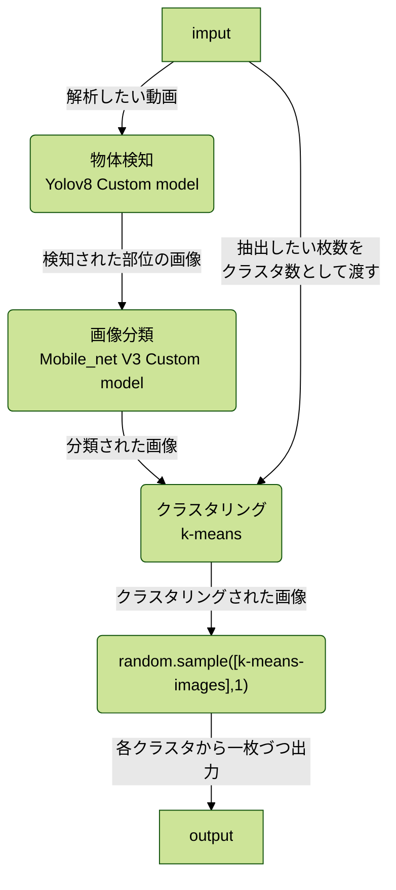

# deep_mou_cut_2
## 動画からマウスの顔をいい感じで画像で保存するアプリ  

https://user-images.githubusercontent.com/129124821/233567500-1bc3d64d-c776-4ac9-bc7a-adc90358869d.mp4

## 説明
映像内のマウスの顔を検知していい感じに切り取ってくれます。  
現在、C57BL/6などの黒マウスの横顔に対応しています。  
  
### 動作フロー

- 物体検知と画像分類モデルをCoreMlへ変換したモデルをDefaultで動作するようにしています。
- 物体検知（PyTorch）・画像分類（TensorFlow ）のモデルも同梱しているので、Windows/Linux/macでの動作が可能です。オプションで指定して下さい。
---

## インストール
1. Ultralyticsをインストールします。  
   ```pip install ultralytics```
2. Scikit-learnをインストールしてください。  
```pip install scikit-learn```  
3. CoreMLに対応したMacの場合は、CoreMLtoolsをインストールします。  
   ```pip install coremltools```  
4. Windows/Linux/macでTensorflowとPyTorchを利用する場合は、以下をインストールします。  
```pip install tensorflow torch torchvision```    
  
numpyでエラーが起こる場合は、pipの方のnumpyを更新します。  
```pip install -U numpy```  

---
### 使い方
  
次のコマンドで解析が始まります。  
```python moucut.py -f <movie_file_path>```  
  
変数に解析したい動画のパスを入れて指定することもできます。  
```
movie="<movie_file_path>"  
python moucut.py -f $movie
```    
  
顔検知中のプレビューを表示させるには、-sオプションをつけて下さい。  
```python moucut.py -f $movie -s```  


### 顔検出でGPUを使う方法
-m　オプションに"tf"を指定して下さい。
-d　オプションに "cuda"を指定して下さい。 
（Macの場合は"mps"）  
```python moucut.py -f ＄movie -m tf -d cuda```  
  
CNNモデルの分類ではTensorFlowを使っています。  
GPUを利用したい場合、お使いのプラットフォームに合わせたTensorFlowを環境にインストールしてください。  
  
  
---
### オプション
| option | description |  
| ---- | ---- |
| -f,--file | 解析したいファイルのパス（必須） |
| -m,--mode | モード[coreml,tf] |
| -d,--device | 物体検知部分で利用するデバイス名 [cpu,cuda,mps]|
| -t,--tool | 使用するツール名 [default,kmeans_image_extractor,all_extract] |
| -i,--image_format | 出力画像のフォーマット [jpg,png] |
| -s,--show | プレビューモード |
| -n,--number | 抽出枚数 |
  
#### modeについて
| --mode | 詳細 |
| ---- | ---- |
| coreml | 物体検出と画像分類にCoreMlモデルを使用します。(default) |
| tf | 物体検出と画像分類にPyTrochとTensorFlowを使用します。 |

#### deviceについて
| --device | 詳細 |
| ---- | ---- |
| cpu | 物体検知にcpuを使います。(default) |
| cuda | 物体検知にCUDAを使います。（n VidiaのGPUが必要です。） |
| mps | AppleのMetal Performance Shadersを使います。 |

#### toolについて
| --tool | 詳細 |
| ---- | ---- |
| all_extract | 動画からマウスの顔を全て抽出します。|
| kmeans_image_extractor | k-meansアルゴリズムを使って動画から指定枚数の画像を抽出し|ます。
  
#### 保存できるフォーマットについて  
- オプションを指定しない場合は、png形式で保存されます。オプションで指定することでjpg形式で保存可能です。
---
### その他動物への対応
お問い合わせください。
